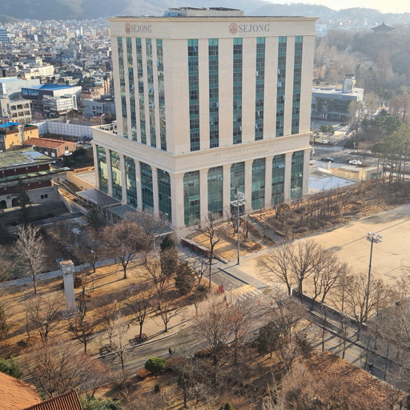
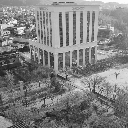
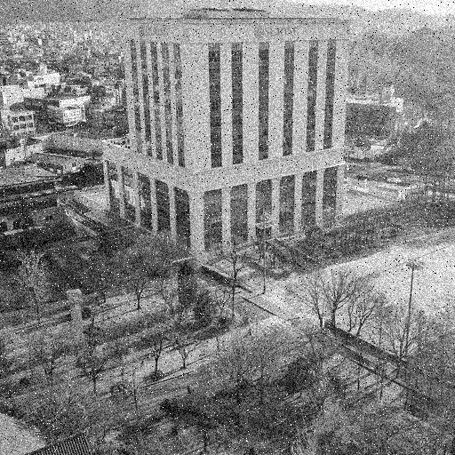
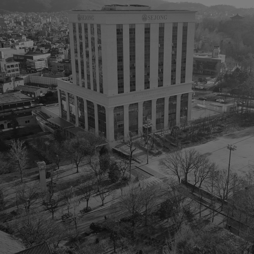
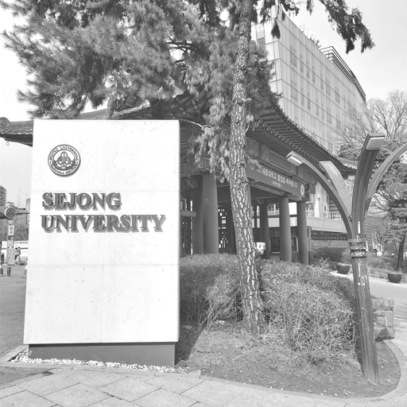
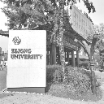
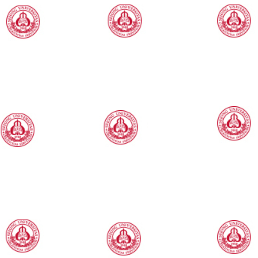

# Image-Processing

해당 레포지토리에는 영상처리 각 파트별 코드가 C로 작성되어 있습니다.  
작업환경은 **visual stduio 2019**이며 해당 버전보다 낮은 경우 일부 코드 작동시에 오류가 발생할 수 있습니다.  
또한 해당 코드들은 bmp 파일을 통한 입출력을 수행합니다.  
총 11주에 걸쳐서 영상처리 관련 코드를 작성하여 테스트 하는 과정을 거쳤습니다.

각 주차별 영상에서 결과와 원본 영상을 비교하는 경우 **PSNR**을 이용하여 평가합니다.  
또한 각 주차별 코드에는 테스트를 위한 원본 영상과 코드 진행 후 저장된 이미지들이 같이 들어있습니다.  

사용한 영상들
-----------

**흑백 영상들의 경우 YCbCr 값 중에서 Y 값만을 추출하였습니다.**

워터마트 영상
-----------

필터 영상
-----------

Week2
-----------
C환경에서 데이터 입출력 및 영상들의 형식에 대해 확인한 것을 바탕으로 읽어들인 이미지 데이터 일부를 변형하여 저장하는 과정입니다.  

Week2-2
-----------
컬러 영상을 구성하는 값들을 RGB, YCbCr의 성분으로 나누어서 추출한 결과를 확인하는 과정입니다.  

Week3
-----------
Pixel operation인 Substraction, Addition, Ratio, Multiplication을 활용하여 워터마크 삽입 및 filtering을 수행합니다. 

Week3-2
-----------
이미지에서 가장 중요한 Luminance component만 추출을 수행하는 코드입니다.

Week3-3
-----------
Noise가 추가된 영상자료에 mean filter, median filter 등의 필터를 적용한 결과를 원본 영상과의 PSNR 비교를 하는 코드입니다.

Week4
-----------
직접 디자인한 필터를 적용하여 원본 이미지에 노이즈를 추가하거나 영상을 개선하는 코드입니다. 

Week4-2
-----------
영상 데이터 값들의 분포를 히스토그램으로 전환하여 이미지 형태로 추출하는 코드입니다.  

Week5-1
-----------
이전 주차에서 진행한 히스토그램을 조건에 맞도록 조절하는 Histogram Equalization 과정이 작성된 코드입니다. (Sliding, Contrast, Image Enhancement, cumulative histogram)

Week5-2
-----------
영상 이미지에 감마 값을 조절하여 밝기를 변화시키는 코드입니다.

Week6-1
-----------
이미지 데이터를 손실시켜 이미지 크기를 줄이는 downsampling 과정이 작성된 코드입니다.

Week6-2
-----------
이미지 데이터에 upsampling을 적용하는 일련의 코드입니다.(Bilinear, NNIF filter 적용)

Week7-1
-----------
영상에 rotation을 적용한 후 발생한 hole 까지 채우는 코드입니다.

Week7-2
-----------
영상에 존재하는 edge들을 검출하는 코드입니다. (Gradinet를 통한 검출)

Week9-1
-----------
Prewiit, Roberts, Sobel 필터들을 사용하여 edge 검출을 진행하며 필요 없는 edge 성분을 제거하기 위해 thresholding을 사용합니다.

Week9-2
-----------
Laplacian filter를 통한 edge 검출 외에도 filter를 통한 노이즈 제거 전 후 edge 검출 결과를 확인합니다.

Week10-1
-----------
영상 압축을 연습하기 위해 bmp 파일을 bitstream 형태로 추출하는 코드입니다.

Week10-2
-----------
Compression이 진행된 bitstream 데이터를 읽어 들여서 다시 복원시키는 decompression 과정입니다.

Week10-3
-----------
영상에 존재하는 edge들을 검출하는 코드입니다. (Gradinet를 통한 검출)

Week11-1
-----------
기존에 진행했던 Compression을 무손실에서 손실 압축으로 변경한 코드입니다.

Week11-2
-----------
Morphology인 Dilation, Erosion, Opening을 적용한 결과를 확인하는 코드입니다.

Week11-3
-----------
손실 압축된 bitstream을 다시 decompression한 결과를 확인하는 코드입니다.
